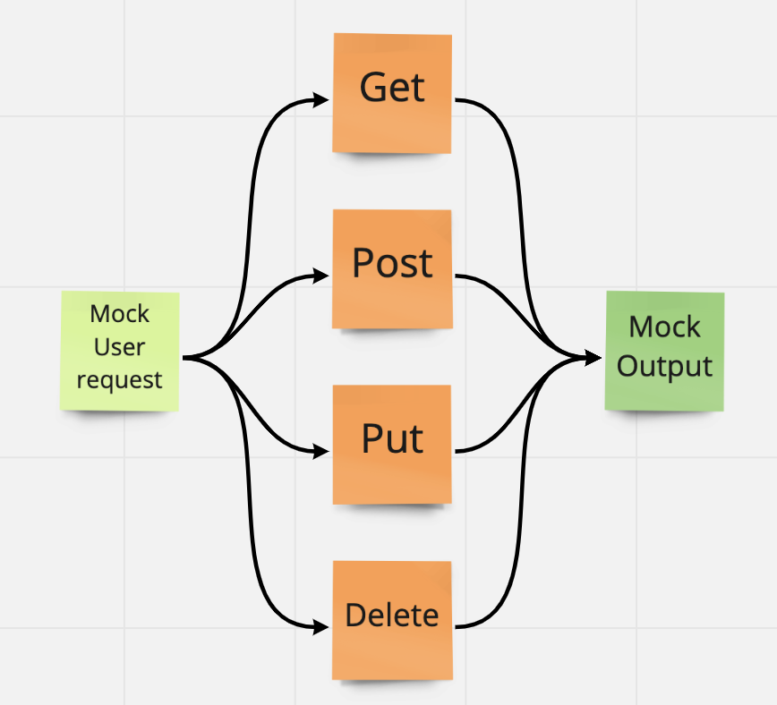

# RESTy: Component Based UI
An API testing tool that can be run in any browser, allowing a user to easily interact with APIs in a familiar interface.

## UML Diagram

## Getting Started

This folder only contains the components required for your React Application.

1. Run `npx create-react-app resty --use-npm` to create your react application.
1. `cd resty` and replace the `src` folder generated by CRA with the `src` folder in this starter-code folder.
1. Run `npm start` to visually validate that your starter-code components are working properly.

## Lab Requirements
### Phase 1
You will be refactoring all child components of the `App` component from `Class` components to `function` components.

- Keep `App.js` a class component for now.
- `Header`, `Footer`, and `Counter` components to separate files.
- Properly `export` them as defaults.
- Import them into the `App` Component using ES6 `import` statement.
- Proper state management.
- Button Handlers.

### Phase 2
Receiving user input in preparation of connecting to live APIs, using the `useState()` hook in our functional components

- Refactor any components using this.setState to implement the useState react API hook.
- Refactor the Form Component to implement user input from form elements, instead of hard coded string values.

### Grading Standards & Notes

- Features
  - As noted
- Code Quality
  - Looking for proper function component syntax.
  - Good file naming and folder structure.
  - Styles well written, using SASS variables/nesting and thought through beyond simple colors.
- Testing
  - Not Required, but testing initial component output is recommended.
- Deployment
  - Code Sandbox only.
- Documentation
  - Quality README

### Approach & Efficiency

- Coded with assistance by Joey Hernandez and Emily Landers.